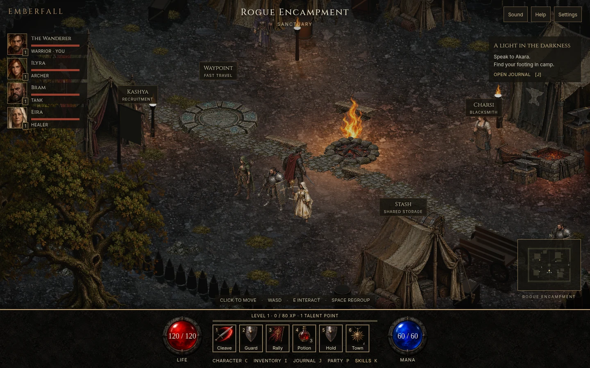

# Emberfall

[](https://github.com/karmiphuc/d2-clone-emberfall/actions/workflows/pages.yml)

**[Play the latest build](https://karmiphuc.github.io/d2-clone-emberfall/)** · [Report a playtest bug](https://github.com/karmiphuc/d2-clone-emberfall/issues/new/choose)

A browser-based, party-focused action RPG prototype built with Three.js. The playable slice includes the Rogue Encampment, a complete first Blood Moor expedition, and a connected Den of Evil dungeon: one hero, three recruitable companions, town services, enemy combat and persistent loot, levels 1–6, usable skill trees, and six companion specialties.



## Downloadable playtest

Run `npm run package:playtest` to produce a single HTML file in `artifacts/`. Downloaded release builds can be opened directly in a modern browser with WebGL enabled; no Node installation is needed to play. Fonts fall back to system fonts offline. Browser storage keeps progress on that device.

## Play locally

Requires Node.js 22+.

```sh
npm ci
npm run dev
```

Open the URL printed by Vite. For a production build, run `npm run build` and `npm run preview`.

## Controls

- Click the ground or use WASD / arrow keys to move.
- Click a town label to approach and interact; E interacts with a nearby service.
- Space or 3 regroups the party. 5 toggles hold/follow.
- Mouse wheel zooms. I opens inventory; J journal; P party; C character; K or T opens skill trees.
- The hero automatically attacks nearby enemies when stationary. Left-click enemies to approach and focus them; movement takes priority over automatic attacks. Right-click an enemy or its label to approach and use Cleave. 1 cleaves (8 mana), queuing once behind an ongoing basic attack; moving cancels the queue. 2 guards for 3 seconds (10 mana, 8-second cooldown); 4 heals; 6 retreats and restores the company.
- Click a mercenary portrait or use Inventory → Equip for to select the hero or any merc. Equip weapons, armor, rings and charms from the shared backpack in camp; Remove returns merc gear to the bag. Gear persists through dismissal and recruitment.
- Click a nearby loot label or walk over a drop to collect it. Downed companions recover in camp.
- Escape closes dialogs. Wind and combat sound are opt-in from the Sound button. Settings can soften combat effects; the system reduced-motion preference is honored.

## Classic presentation

Scene pixel resolution adapts gradually to sustained slow frames while UI text stays sharp. The camp and Blood Moor use distinct terrain and dusk lighting, soft character contact shadows, a closer hero-following isometric camera, original illustrated tents, town services, foliage and fire, textured ground and detailed directional character sprites. Hero sword/axe attacks use 33 playback frames across preparation, coil, downstroke, contact, follow-through, recovery and guard. Damage, sound and Cleave mana cost occur on contact; movement cancels anticipation. Render interpolation smooths movement between simulation ticks, while longer baked sprite sequences provide the intermediate silhouettes without runtime optical-flow deformation. Distance-driven footstep timing removes idle-frame interruptions from the hero and companion walks. Projectiles and effects use the same fractional render clock; static scenery shadows are cached. Characters and creatures use 16-frame movement loops; new hero passing steps separate the foot-contact poses. All six companions have role-specific 17-frame strike and recovery sequences. Every actor has three complete movement and attack sets, selected from independent shuffled bags at action boundaries. Hero sword/axe attacks include original low-side and high-diagonal alternate poses; companion and creature alternatives use anchored weight, lean and recovery variations. Sprite mattes and diffuse exposure are normalized to prevent opacity/lighting pulses. Monsters face their victim during windup and visibly strike. Cleave, frost, healing, holy and shadow attacks use original painted effects; hits produce a restrained directional recoil and a short target recoil; defeated enemies settle and fade. Arrows, frost lances and healing motes travel tip-first toward their targets. Guard stays around the hero for its active duration, and Eira prioritizes casting toward the wounded ally. The classic stone HUD has illustrated portraits, life/mana globes and labelled actions. The action bar shows queued Cleave, Guard duration/cooldown, Battle Cry cooldown, low mana, potion availability and party hold state. Inventory is a side panel with a painted equipment portrait and a directional character preview with Stand, Walk and Attack controls, illustrated slots and side-by-side item comparisons. Sword and axe world sprites switch immediately when equipped and survive reload; elemental weapons add a light accent. All seven weapons have individual inventory illustrations. Enemy hover/selection highlights and silhouette-aware picking make targets clearer; transparent sprite margins remain ground. Nearby drops have clickable name labels. The skill tree uses nine distinct illustrated talent icons, connected ranks, current/next-rank details and free camp respecs. On phones, branch buttons keep all three tiers readable. Backpack filters and sorting help compare larger loot collections.

This is a stylized, original-asset interpretation of the classic game, not a pixel-perfect recreation of Diablo II or Resurrected.

## Included

- Isometric camp with illustrated tents, forge, stash, waypoint, forest, animated fire, sparks and lighting.
- Click-to-move A\* paths with obstacle clearance and companion following.
- Akara's introduction, camp preparation quest, rest, and potion purchases.
- Charsi's weapon purchase and equipment change.
- Recruitment, direct companion swaps and dismissal through Kashya, shared gold stash, and a camp waypoint.
- Local browser save, reset option, performance mode, and a live minimap.

Enter the eastern gate to fight 12 enemies, including the Ashen Brute. Clear the encounter, collect the Ashen charm, and claim 100 gold and two potions from Akara. Retreat at any time; slain enemies and uncollected drops persist. Reloading starts the party safely in camp.

After collecting all 12 drops, return to the eastern gate and choose **Start fresh hunt**. Progress, equipment, talents and recruitment choices carry over. Four clears reach the level-6 playtest cap; enemy scaling stops after hunt 4. Each enemy guarantees an equipment drop. The 60-slot bag automatically sells overflow drops. Change equipment and talents in camp.

The northeastern cleft in the Moor leads to the **Den of Evil** (recommended level 3): three connected chambers, 11 creatures including the Gravewarden, and a one-time 175 gold / 3 potion bounty from Akara. The entrance label approaches and enters the cave; the exit returns to the Moor. Dungeon kills and loot survive retreats/reloads independently of repeat Moor hunts. Living dungeon enemies reset when changing areas. The Den stays clear once completed.

All six mercenaries can equip armor, rings and charms. Ilyra uses bows, Bram maces, Eira/Soren staves, Aldric swords or maces, and Nyx paired daggers. Charsi sells eight original mercenary weapons, also available as loot. Gear changes damage, life, armor, casting speed and Eira’s healing; class weapon silhouettes remain fixed, with enchanted equipment adding a light accent.

Bram taunts and absorbs damage; Eira heals injured allies; Ilyra fires volleys; Soren slows groups with frost; Aldric protects nearby allies; Nyx flanks and backstabs. Companions share your level and grow in life and damage.

This is an early vertical slice, not a completed Act I. The remaining Act I campaign, additional hero classes, companion-specific talent trees and multiplayer are not implemented. Combat balance and environment geometry remain provisional. Characters use original four-direction painted sprites, with 16-frame movement and 33/17-frame action playback. Intermediate frames are generated from a smaller set of authored poses; dense authored companion gaits, eight-direction turning and authored death sequences remain unfinished. No Diablo assets are bundled.

## GitHub Pages

The included `.github/workflows/pages.yml` builds and deploys on pushes to `main`. The repository owner must enable Pages once: Settings → Pages → Source → **GitHub Actions**. The workflow attempts enablement where permissions allow. Vite uses relative asset paths so repository subpaths work.

## Structure

- `src/world.js`: rendering, camp, characters, grid navigation and animation.
- `src/wilderness.js`: authored wilderness scenery.
- `src/dungeon.js` and `src/game/den.js`: cave presentation, connected footprint, encounters and bounty.
- `src/actor-sprites.js` and `src/animation.js`: directional atlases and motion state.
- `src/combat-effects.js` and `src/combat-audio.js`: pooled effect sprites and opt-in combat cues.
- `src/scenery.js`: illustrated props, instanced grass and hero occlusion fading.
- `src/sprite-picking.js`: compact alpha masks for visible-silhouette targeting.
- `src/game/combat.js`: rendering-independent battle rules and encounter data.
- `src/game/save.js`: save validation, migration, repeat hunts and reward transactions.
- `src/game/items.js`: equipment definitions, drops and inventory transactions.
- `src/game/progression.js`: level thresholds and talent requirements.
- `src/game/companions.js`: role definitions and party-size enforcement.
- `src/main.js`: UI, town interactions, party state, local saves.
- `src/style.css`: responsive game interface.

## Next milestone

Prioritize character motion and combat presentation: longer, consistently alternating hero/companion gaits, eight-facing movement and authored death animation. The remaining Act I route, deeper skills and companion tactics remain on the roadmap.

## Development

See [CONTRIBUTING.md](CONTRIBUTING.md), [architecture](docs/ARCHITECTURE.md) and the [chapter roadmap](PLAN.md). Browser tests run before every deployment. Development test hooks are excluded from production builds.
