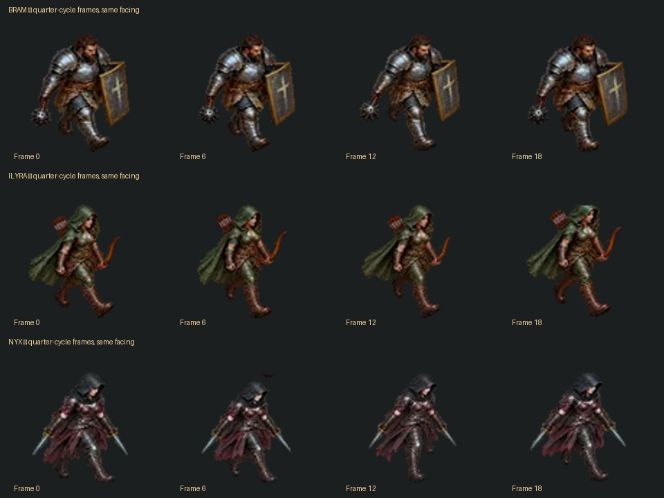

# Character animation research — 10 October 2026

The current animation source needs rebuilding. The v0.19 changes simplified playback, but the existing source poses do not describe a convincing gait. Passing runtime tests established that frames advance and gameplay works; those checks did not establish animation quality.

## What other games actually do

| Reference                                                                                                                                                                 | Documented approach                                                                                                                                                                     | Useful lesson for Emberfall                                                                                                                        |
| ------------------------------------------------------------------------------------------------------------------------------------------------------------------------- | --------------------------------------------------------------------------------------------------------------------------------------------------------------------------------------- | -------------------------------------------------------------------------------------------------------------------------------------------------- |
| [Diablo II: Erich Schaefer's developer postmortem](https://www.gamedeveloper.com/design/postmortem-blizzard-s-i-diablo-ii-i-)                                             | Models and animation were made in 3D Studio Max, rendered from 16 directions for player characters and eight for monsters. Armor and body components were rendered separately.          | Author coherent 3D motion first, then bake it to the desired sprite aesthetic. Equipment must share the motion and direction of the body.          |
| [Flare: Clint Bellanger's render workflow](https://flarerpg.org/2015/06/07/20150607/)                                                                                     | A Blender mannequin contains animation Actions and a render platform. Armor is attached to the armature, and every animation frame is rendered from eight directions.                   | One skeleton, stable camera/light setup, reusable actions and attached equipment produce consistent frames and easy retakes.                       |
| [Dead Cells: Thomas Vasseur's animation deep dive](https://www.gamedeveloper.com/production/art-design-deep-dive-using-a-3d-pipeline-for-2d-animation-in-i-dead-cells-i-) | Characters use 3D skeletons rendered into small 2D frames. The artist validates convincing key poses and timing before adding interpolation; attack poses and effects establish impact. | Good poses and timing must come before increasing frame count. Interpolating an incorrect pose sequence cannot supply convincing weight or intent. |
| [Spine: staff guidance on sliding feet](https://esotericsoftware.com/forum/d/17130-character-walks-i-see-that-it-slides-)                                                 | Animate with a known translation speed, calibrate planted feet against it, and preserve that speed relationship in the game.                                                            | A constant animation cadence combined with arbitrary movement speed still slides. Validate the cycle in motion, with ground reference marks.       |

Flare's [actual skeleton animation definition](https://github.com/flareteam/flare-game/blob/master/mods/fantasycore/animations/enemies/skeleton.txt) has an eight-frame looping run lasting 533 ms. This is a concrete example of a modest frame count; it is not evidence that every character should use that count or timing.

Three.js also supports live skeletal animation through [AnimationMixer and AnimationAction](https://threejs.org/manual/pages/animation-system.html). This is a feasible alternative, but baking original rigged characters into sprites is the closer match to the requested classic Diablo II presentation. The recommendation is an inference from the workflows above, not a claim that every RPG uses one method.

## What is wrong in our current assets

The image samples frames 0, 6, 12 and 18 from one facing and the active bank. It is enlarged for diagnosis, not a proposed visual treatment. The figures repeatedly present an extended leading leg with insufficient readable alternation and passing motion. The shape changes between samples without a clear progression of planted-foot support and weight transfer. This is a visual assessment, not an instrumented foot-slip measurement.

Code inspection confirms why more frames did not solve it:

- `scripts/build-companion-gaits.py` supplies four painted key images, substitutes a separately painted opposite contact, and uses six RIFE samples per segment to obtain 24 frames. Those are inferred images, not 24 individually animated skeletal poses.
- `scripts/build-animation-sequences.py` registers each key by scaling its head-to-lowest-foot extent and aligning its chest to an idle reference. That can change limb proportions and suppress the intended vertical body movement. A moving foot is not a stable coordinate origin.
- The same baker creates mercenary attacks from two attack paintings plus an idle painting, filling the gaps to make 17 frames. This does not guarantee a coherent weapon arc, grip, weight transfer or recovery.
- `src/animation.js` has four facing quadrants. Smooth rotation of the actor still selects one of only four painted views, so facing changes remain visually coarse.
- `src/actor-sprites.js` uses a 0.8-second mercenary loop while `src/companion-follow.js` accelerates, brakes and changes catch-up speed. That combination does not guarantee a planted foot matches ground travel. The hero's normal four-unit movement speed is a useful fixed calibration case.
- The current 96-pixel merc cells limit detail when enlarged, but replacing them with larger versions of the same poses would preserve the underlying gait defect.

Per-frame matte thresholding and exposure matching in `scripts/sprite_consistency.py` are also a possible source of changing edge coverage or surface appearance. This needs measurement before assigning it a share of the visible flicker; normalization does not repair missing motion.

## Replacement pipeline

1. **Prove one hero and one tank first.** Use a coherent original or appropriately licensed rigged character. Establish the silhouette and materials at actual game size before extending the process to all six mercenaries.
2. **Author a complete gait.** Establish contact, down, passing and up poses for each leg, with planted-foot support, hip weight transfer and shoulder counter-rotation. Validate the eight main poses before rendering intermediates. Keep weapon hands in a purposeful carry pose.
3. **Calibrate travel.** Specify the distance traveled per full two-step cycle. Test it moving over a marked ground plane. Keep one stable cadence at the calibrated base speed; use bounded rate changes for small speed variations and a distinct run/catch-up clip for larger changes. Preserve gait phase through direction changes.
4. **Bake consistent sprites.** Keep one world origin, orthographic camera, framing scale and light setup for the entire character/action set. Render 16 hero directions and initially eight mercenary directions. Sample genuine rig motion into roughly 24–30 frames per second, adjusting after visual review. Do not resize each pose to an idle silhouette or morph unrelated painted key images.
5. **Author combat as actions.** Build guard, anticipation, swing/release, contact, follow-through and recovery around the real weapon or spell. Use a contact event tied to the damage/projectile event. Derive variants from separate authored actions; retain readability rather than uniformly slowing every part of the strike.
6. **Equip on the rig.** Attach weapons to hand sockets before baking. Render required weapon layers or combinations with identical action time, facing and root coordinates. Record attachment/depth metadata for any runtime layers. This prevents weapon changes from becoming static overlays that drift from the hand.
7. **Integrate after visual validation.** Use the existing interpolated world movement and gameplay systems, with simple directional sprite playback and explicit idle/walk/run/attack/recovery states. Fix the source animation before revisiting shader blends.

## Acceptance checks

- Review two complete cycles in motion at actual camp scale, with scenery both visible and hidden; also inspect enlarged frames.
- Verify that left and right steps alternate and each support foot stays on the ground throughout its planted interval.
- Export ankle trajectories from the rig and compare their projected world positions against ground movement. Target at most one screen pixel of planted-foot drift at the reference game viewport; this is a proposed gate, not a measured current result.
- Check loop seams, start/stop behavior, 45-degree turns and direction changes without actor scale, identity or lighting changes.
- Match contact events to damage/release, and check that repeated attacks finish or deliberately cancel recovery according to gameplay rules.
- Review equipped weapons in every supported facing and at contact, crossing and recovery poses.
- Inspect alpha coverage and opaque surface appearance separately from scene lighting. A true change in silhouette area is allowed; changing material opacity is not.
- Run existing navigation, Hold, combat and equipment regression tests after integration. These complement visual review and cannot replace it.

The research informed the subsequent v0.20 hero/Bram prototype. Its implemented scope, measured rig contacts, visual artifacts and remaining limits are recorded in [the pilot review](../qa-v0.20.md). The one-pixel ground-drift criterion above remains a proposed visual gate; skeleton-space IK checks do not prove it.
